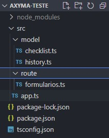
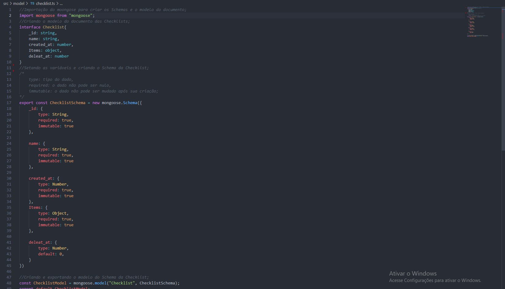
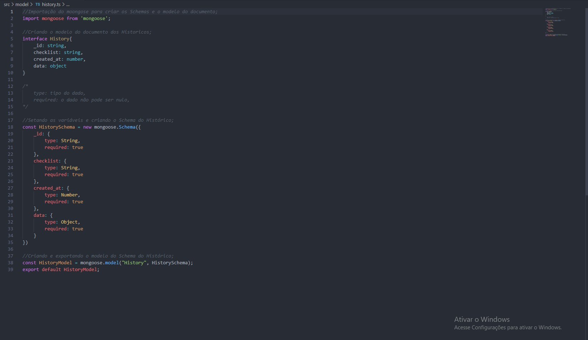
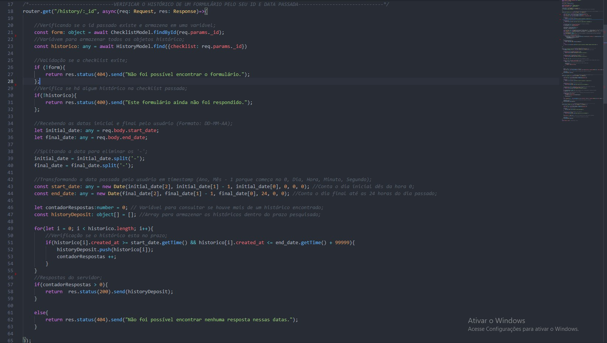
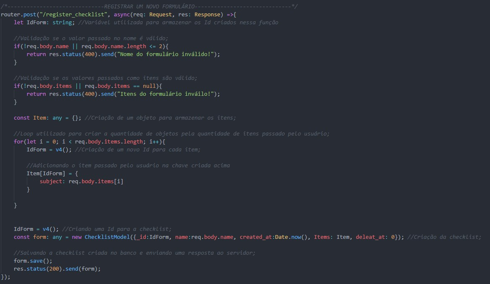
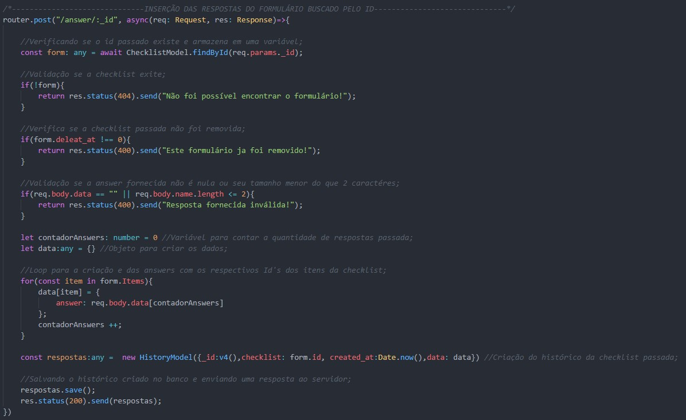
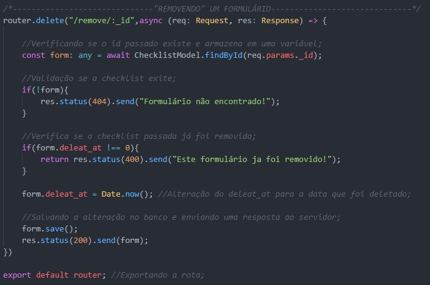
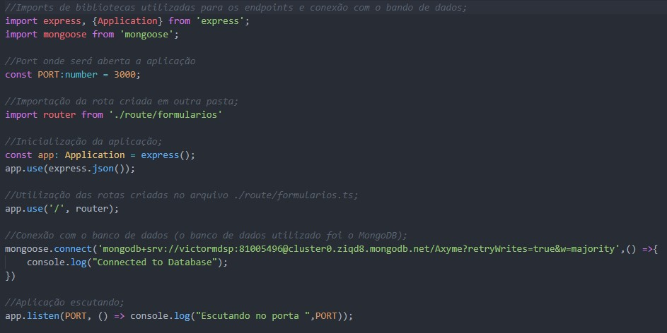
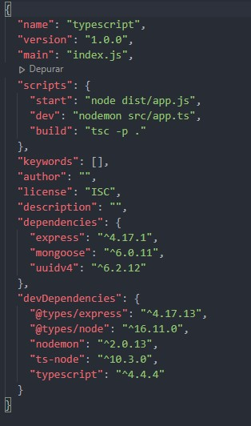
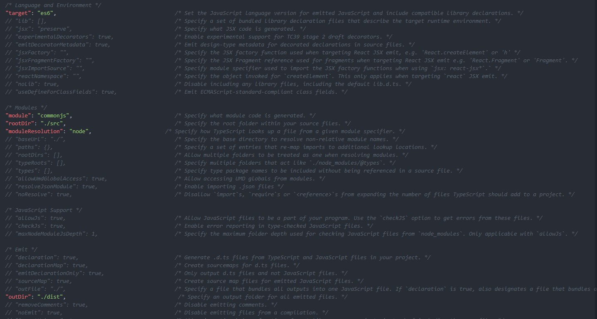

# Axyma-Teste

<section>
  <h2>Contextualização</h2>
    
 Resolução do desafio proposto pela empresa Axyma em desenvolver um projeto Back-End. 

</section>

<section>
  <h2>Tecnologias utilizadas</h2>
    <ul>
      <li>NodeJs</li>
      <li>TypeScript</li>
      <li>MongoDb</li>
    </ul>
    
 A proposta do desafio recomendava utilizar o firebase, porém como já possuo conhecimento com MongoDB preferi optar por ele. 

    <h2>Bibliotecas utilizadas</h2>
    <ul>
      <li>Express (Criação das rotas)</li>
      <li>uuidv4 (Criação dos Id's)</li>
    </ul>
    
 Foi utilizado o Visual Studio Code para o desenvolvimento de todo o código. 

</section>
  
<section>
  <h2>Implementação do código</h2>
  <h3>Organização das pastas</h3>
  
  
Como pasta principal temos a Axyma-Teste.

  
Olhando abaixo temos a pasta src, onde estão as pastas model e a pasta route.

  
Dentro da pasta model temos os arquivos dos Schemas, checklist.ts com o Schema das checklists e history.ts com o Schema dos históricos.

  
Dentro da pasta route temos um arquivo formularios.ts com todas as rotas do programa.

  
Por fim temos o arquivo app.ts que é o arquivo principal, um arquivo package-lock.json, um arquivo package.json com algumas configurações e o arquivo tsconfig.json com as configurações do TypeScript.

  
  <h2> Pasta Model </h2>
  <article>
    <h3>Schema checklist</h3>
    
Primeiramente foi importado o mongoose, em seguida criado a interface com os atributos que o documento iria receber, logo em seguida foi criado o Schema Checklist e setando as informações dos atributos.

    <ul>
      <li>type: tipo do dado</li>
      <li>required: o dado não pode ser nulo</li>
      <li>immutable: o dado não pode ser mudado após sua criação</li>
    </ul>
    
Por fim foi feito o modelo do Schema criado e o mesmo foi exportado.

    
Imagem abaixo: 

    
  </article>
  
  <article>
    <h3>Schema Histórico</h3>
    
Primeiramente foi importado o mongoose, em seguida criado a interface com os atributos que o documento iria receber, logo em seguida foi criado o Schema History e setando as informações dos atributos.

    <ul>
      <li>type: tipo do dado</li>
      <li>required: o dado não pode ser nulo</li>
    </ul>
    
Por fim foi feito o modelo do Schema criado e o mesmo foi exportado.

    
Imagem abaixo: 

    
  </article>
</section>

<section>
  <h2>Pasta Route</h2>
  
Dentro da pasta Route temos o arquivo formularios.ts com todas as rotas criadas (get "/", get "/history/:_id" ,post "/register_checklist", post "/answer/:_id", delete "remove/:_id"), cada uma com suas implementações.
    
Imagens abaixo: 

    
    
    
    
</section>

<section>
  <h2>Arquivos de configurações</h2>
  <h3>app.ts</h3>
  
Arquivo principal, com a chamada das rotas e criação da aplicação

   
Imagem abaixo: 

  
  <h3>package.json</h3>
  
Configurações de pacotes instalados e formas para rodar o código, foi alterado o "start" para criar uma pasta dist com um arquivo app.js quando o código for buildade, "dev" para rodar o código com nodemon utilizando o arquivo dentro do src/app.ts
  onde ficam as alterações do TypeScript, dentro dessas configurações o "target" foi alterado para es6, "rootDir" para o arquivo ./src e o "outDir" para ./dist.

   
Imagem abaixo: 

  
  <h3>TypeScript</h3>
  
Arquivo onde ficam as alterações do TypeScript, dentro dessas configurações o "target" foi alterado para es6, "rootDir" para o arquivo ./src e o "outDir" para ./dist.

  
Imagem abaixo: 

  
</section>

<h2> Obrigado pela atenção e oportunidade! </h2>

 Ass: Victor Martini Domingues 

